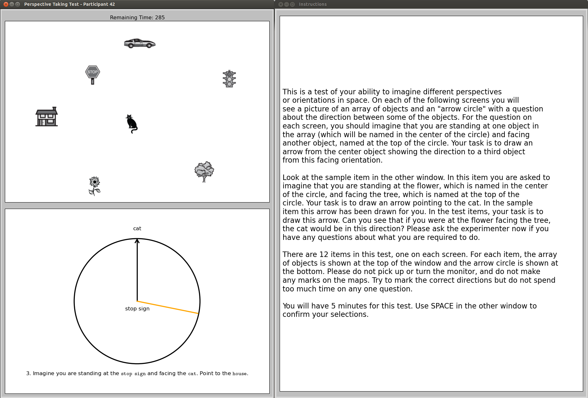

# Perspective Taking/Spatial Orientation Test (PTSOT)

This is my version of the **Perspective Taking/Spatial Orientation Test (PTSOT)**, adapted from [TimDomino/ptsot](https://github.com/TimDomino/ptsot) for my course project in Cognitive Underpinnings of Learning Technology (CGS614)

 
## Screenshot

